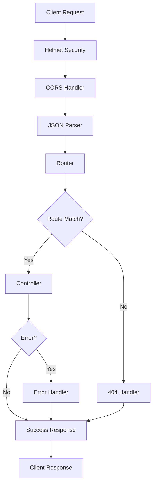

## Project Structure

The Backend Template follows a modular architecture that separates concerns between application setup, server initialization, routing, and utilities.

<CardGroup cols={2}>
  <Card title="src/app.js" icon="gear">
    Express application configuration and middleware setup
  </Card>
  <Card title="src/server.js" icon="server">
    Server initialization and database connection
  </Card>
  <Card title="src/routes/" icon="route">
    API route definitions and handlers
  </Card>
  <Card title="src/utils/" icon="wrench">
    Utility functions and helpers
  </Card>
</CardGroup>

## Application vs Server Separation

The template uses a clean separation between the Express application (`app.js`) and the server entry point (`server.js`). This design pattern provides several benefits:

<Steps>
  <Step title="Application Configuration (app.js)">
    Defines the Express app, middleware stack, and routes without starting the server. This makes the app testable and reusable.
  </Step>
  
  <Step title="Server Initialization (server.js)">
    Handles database connection, server startup, and environment-specific logic.
  </Step>
  
  <Step title="Export and Import">
    The app is exported from `app.js` and imported in `server.js`, enabling easy testing and modular design.
  </Step>
</Steps>

### Application Setup (app.js)

The `src/app.js` file configures the Express application with all necessary middleware and routes:

```javascript src/app.js
const express = require('express');
const helmet = require('helmet');
const cors = require('cors');
const router = require('./routes');
const errorHandler = require('./utils/errorHandler');
require('dotenv').config();

// Esta es nuestra aplicación
const app = express();

// Middlewares 
app.use(express.json());
app.use(helmet({
    crossOriginResourcePolicy: false,
}));
app.use(cors());

app.use(router);
app.get('/', (req, res) => {
    return res.send("Welcome to express!");
})

// middlewares después de las rutas
app.use(errorHandler)

module.exports = app;
```

<Note>
Notice that `app.js` does **not** call `app.listen()`. It only exports the configured Express application, making it easy to import for testing or other purposes.
</Note>

### Server Entry Point (server.js)

The `src/server.js` file imports the app and handles server startup with database initialization:

```javascript src/server.js
const app = require('./app');
const sequelize = require('./utils/connection');

const PORT = process.env.PORT || 8080;

const main = async () => {
    try {
        sequelize.sync();
        console.log("DB connected");
        app.listen(PORT);
        console.log(`👉 Server running on port ${PORT}`);
        console.log(`👉 Link http://localhost:${PORT}`);
    } catch (error) {
        console.log(error)
    }
}

main();
```

<Tip>
This separation allows you to import the app in test files without starting the server:
```javascript
const request = require('supertest');
const app = require('./src/app');

test('GET /', async () => {
  const response = await request(app).get('/');
  expect(response.status).toBe(200);
});
```
</Tip>

## Request Flow

Understanding how requests are processed through the application:

<Steps>
  <Step title="Incoming Request">
    Client sends HTTP request to the server
  </Step>
  
  <Step title="Security Middleware">
    Request passes through `helmet()` for security headers and `cors()` for CORS handling
  </Step>
  
  <Step title="Body Parsing">
    `express.json()` parses JSON request bodies
  </Step>
  
  <Step title="Route Matching">
    Request is matched against defined routes in `src/routes/`
  </Step>
  
  <Step title="Controller Execution">
    Route handler or controller processes the request
  </Step>
  
  <Step title="Error Handling">
    If an error occurs, the `errorHandler` middleware catches and formats it
  </Step>
  
  <Step title="Response">
    Server sends response back to client
  </Step>
</Steps>



## Directory Structure

```
src/
├── app.js              # Express app configuration
├── server.js           # Server entry point
├── routes/
│   └── index.js        # Main router (route aggregator)
├── utils/
│   ├── connection.js   # Database connection
│   ├── errorHandler.js # Global error handler
│   └── catchError.js   # Async error wrapper
```

<Accordion title="Why this structure?">
  
**Separation of Concerns**: Each file has a single, clear responsibility.

**Testability**: The app can be tested without starting a server.

**Scalability**: Easy to add new routes, middleware, or utilities.

**Maintainability**: Clear organization makes it easy to locate and modify code.

**Reusability**: The app can be imported and used in different contexts (tests, scripts, etc.).

</Accordion>

## Best Practices

<CardGroup cols={2}>
  <Card title="Keep app.js Pure" icon="flask">
    Don't start the server in `app.js`. Only configure and export the Express app.
  </Card>
  
  <Card title="Centralize Configuration" icon="sliders">
    Use environment variables loaded via `dotenv` for all configuration.
  </Card>
  
  <Card title="Modular Routes" icon="puzzle-piece">
    Organize routes by resource or feature in separate files under `src/routes/`.
  </Card>
  
  <Card title="Error Handling" icon="shield-halved">
    Always use the error handler middleware and wrap async routes with `catchError`.
  </Card>
</CardGroup>

## Next Steps

<CardGroup cols={3}>
  <Card title="Database Setup" icon="database" href="/core/database">
    Learn about Sequelize integration
  </Card>
  
  <Card title="Middleware" icon="layer-group" href="/core/middleware">
    Understand the middleware stack
  </Card>
  
  <Card title="Routing" icon="route" href="/guides/routing">
    Create your first API route
  </Card>
</CardGroup>