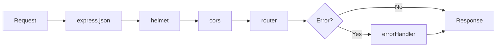

## What is Middleware?

Middleware functions are functions that have access to the request (`req`), response (`res`), and the next middleware function in the application's request-response cycle, commonly denoted by `next`.

<CardGroup cols={3}>
  <Card title="Request Processing" icon="arrow-right">
    Intercept and process incoming requests
  </Card>
  <Card title="Response Modification" icon="pen-to-square">
    Modify responses before sending to client
  </Card>
  <Card title="Error Handling" icon="shield-halved">
    Catch and handle errors centrally
  </Card>
</CardGroup>

## The Middleware Stack

The Backend Template uses a carefully ordered middleware stack in `src/app.js`:

```javascript src/app.js
const express = require('express');
const helmet = require('helmet');
const cors = require('cors');
const router = require('./routes');
const errorHandler = require('./utils/errorHandler');
require('dotenv').config();

const app = express();

// Middlewares 
app.use(express.json());
app.use(helmet({
    crossOriginResourcePolicy: false,
}));
app.use(cors());

app.use(router);
app.get('/', (req, res) => {
    return res.send("Welcome to express!");
})

// middlewares después de las rutas
app.use(errorHandler)

module.exports = app;
```

## Middleware Execution Order

<Warning>
Middleware order matters! Each middleware is executed in the order it's registered with `app.use()`.
</Warning>

<Steps>
  <Step title="1. express.json()">
    Parses incoming JSON request bodies and makes them available in `req.body`
  </Step>
  
  <Step title="2. helmet()">
    Sets security-related HTTP headers to protect against common vulnerabilities
  </Step>
  
  <Step title="3. cors()">
    Enables Cross-Origin Resource Sharing for API access from different domains
  </Step>
  
  <Step title="4. router">
    Routes requests to appropriate handlers based on path and HTTP method
  </Step>
  
  <Step title="5. errorHandler">
    Catches any errors thrown during request processing (must be last)
  </Step>
</Steps>



## Built-in Middleware

### express.json()

Parses incoming requests with JSON payloads and populates `req.body`.

```javascript
app.use(express.json());
```

**Example Request:**
```bash
curl -X POST http://localhost:8080/api/users \
  -H "Content-Type: application/json" \
  -d '{"firstName": "John", "lastName": "Doe"}'
```

**In Your Controller:**
```javascript
const create = catchError(async (req, res) => {
    console.log(req.body); // { firstName: 'John', lastName: 'Doe' }
    const user = await User.create(req.body);
    return res.status(201).json(user);
});
```

<Tip>
You can also use `express.urlencoded({ extended: true })` to parse URL-encoded form data.
</Tip>

## Security Middleware

### helmet()

Helmet helps secure Express apps by setting various HTTP headers. It's a collection of 15 smaller middleware functions.

```javascript
app.use(helmet({
    crossOriginResourcePolicy: false,
}));
```

**Headers Set by Helmet:**
- `Content-Security-Policy` - Prevents XSS attacks
- `X-DNS-Prefetch-Control` - Controls browser DNS prefetching
- `X-Frame-Options` - Prevents clickjacking
- `X-Content-Type-Options` - Prevents MIME type sniffing
- `Strict-Transport-Security` - Enforces HTTPS
- And more...

<Note>
The `crossOriginResourcePolicy: false` option is set to allow loading resources from different origins, which is useful during development and for serving media files.
</Note>

<Accordion title="Customizing Helmet">
  
You can enable/disable specific helmet features:

```javascript
app.use(helmet({
    contentSecurityPolicy: {
        directives: {
            defaultSrc: ["'self'"],
            styleSrc: ["'self'", "'unsafe-inline'"],
            scriptSrc: ["'self'", "trusted-cdn.com"],
            imgSrc: ["'self'", "data:", "https:"],
        },
    },
    crossOriginResourcePolicy: { policy: "cross-origin" },
    crossOriginEmbedderPolicy: false,
}));
```

</Accordion>

### cors()

Enables Cross-Origin Resource Sharing, allowing your API to be accessed from different domains.

```javascript
app.use(cors());
```

**Default Behavior:**
- Allows requests from any origin
- Permits all standard HTTP methods
- Includes credentials in requests

<Accordion title="Configuring CORS">
  
For production, you should restrict CORS to specific origins:

```javascript
const corsOptions = {
    origin: process.env.FRONTEND_URL || 'http://localhost:3000',
    credentials: true,
    optionsSuccessStatus: 200
};

app.use(cors(corsOptions));
```

**Multiple Origins:**
```javascript
const allowedOrigins = [
    'http://localhost:3000',
    'https://myapp.com',
    'https://www.myapp.com'
];

const corsOptions = {
    origin: function (origin, callback) {
        if (!origin || allowedOrigins.indexOf(origin) !== -1) {
            callback(null, true);
        } else {
            callback(new Error('Not allowed by CORS'));
        }
    },
    credentials: true
};

app.use(cors(corsOptions));
```

**Specific Routes:**
```javascript
// Enable CORS for specific routes only
app.get('/api/public', cors(), (req, res) => {
    res.json({ message: 'Public endpoint' });
});
```

</Accordion>

## Error Handling Middleware

The template includes a sophisticated error handler in `src/utils/errorHandler.js`:

```javascript src/utils/errorHandler.js
const errorHandler = (error, _req, res, _next) => {
    if(error.name === 'SequelizeValidationError') {
        const errObj = {};
        error.errors.map(er => {
            errObj[er.path] = er.message;
        })
        return res.status(400).json(errObj);
    }
    if(error.name === 'SequelizeForeignKeyConstraintError'){
        return res.status(400).json({ 
            message: error.message,
            error: error.parent.detail
        });
    }
    if(error.name === 'SequelizeDatabaseError'){
        return res.status(400).json({ 
            message: error.message
        });
    }
    return res.status(500).json({
        message: error.message,
        error: error
    });
}

module.exports = errorHandler;
```

<Note>
Error handling middleware must be registered **after** all routes. It has four parameters: `(error, req, res, next)`.
</Note>

### Error Types Handled

<Accordion title="SequelizeValidationError">
  
Occurs when model validation fails.

**Example Response:**
```json
{
  "email": "Invalid email format",
  "firstName": "First name is required"
}
```

**Triggering Code:**
```javascript
const User = sequelize.define('user', {
    email: {
        type: DataTypes.STRING,
        validate: {
            isEmail: { msg: 'Invalid email format' }
        }
    }
});

// Will trigger validation error
await User.create({ email: 'not-an-email' });
```

</Accordion>

<Accordion title="SequelizeForeignKeyConstraintError">
  
Occurs when a foreign key constraint is violated.

**Example Response:**
```json
{
  "message": "Foreign key constraint error",
  "error": "Key (user_id)=(999) is not present in table users"
}
```

**Common Cause:**
```javascript
// Trying to create a post with non-existent user
await Post.create({ title: 'Test', userId: 999 });
```

</Accordion>

<Accordion title="SequelizeDatabaseError">
  
General database errors (syntax errors, connection issues, etc.).

**Example Response:**
```json
{
  "message": "column 'invalid_column' does not exist"
}
```

</Accordion>

<Accordion title="Generic Errors (500)">
  
All other unhandled errors return a 500 status.

**Example Response:**
```json
{
  "message": "Something went wrong",
  "error": { /* error object */ }
}
```

<Warning>
In production, avoid sending full error objects to clients as they may contain sensitive information. Consider this production-safe version:

```javascript
return res.status(500).json({
    message: process.env.NODE_ENV === 'production' 
        ? 'Internal server error' 
        : error.message
});
```
</Warning>

</Accordion>

### Async Error Wrapper

The `catchError` utility ensures async errors are passed to the error handler:

```javascript src/utils/catchError.js
const catchError = controller => {
    return (req, res, next) => {
        controller(req, res, next)
            .catch(next);
    }
}

module.exports = catchError
```

**Usage:**
```javascript
const User = require('../models/User');
const catchError = require('../utils/catchError');

const getAll = catchError(async (req, res) => {
    const users = await User.findAll();
    return res.json(users);
});
```

<Tip>
**Always wrap async route handlers with `catchError`**. Without it, promise rejections won't be caught by the error handler.
</Tip>

## Creating Custom Middleware

You can create custom middleware for authentication, logging, validation, etc.

### Authentication Middleware Example

```javascript src/middleware/auth.js
const jwt = require('jsonwebtoken');

const verifyJWT = (req, res, next) => {
    const token = req.headers.authorization?.split(' ')[1];
    
    if (!token) {
        return res.status(401).json({ message: 'Token required' });
    }
    
    try {
        const decoded = jwt.verify(token, process.env.JWT_SECRET);
        req.user = decoded;
        next();
    } catch (error) {
        return res.status(401).json({ message: 'Invalid token' });
    }
};

module.exports = verifyJWT;
```

**Using in Routes:**
```javascript
const express = require('express');
const verifyJWT = require('../middleware/auth');
const userController = require('../controllers/user.controller');

const router = express.Router();

// Public route
router.post('/login', userController.login);

// Protected routes
router.get('/profile', verifyJWT, userController.getProfile);
router.put('/profile', verifyJWT, userController.updateProfile);

module.exports = router;
```

### Logging Middleware Example

```javascript src/middleware/logger.js
const logger = (req, res, next) => {
    const start = Date.now();
    
    res.on('finish', () => {
        const duration = Date.now() - start;
        console.log(`${req.method} ${req.path} - ${res.statusCode} - ${duration}ms`);
    });
    
    next();
};

module.exports = logger;
```

**Add to app.js:**
```javascript
const logger = require('./middleware/logger');

app.use(logger);
app.use(express.json());
// ... rest of middleware
```

### Validation Middleware Example

```javascript src/middleware/validateUser.js
const validateUser = (req, res, next) => {
    const { email, password } = req.body;
    
    if (!email || !password) {
        return res.status(400).json({ 
            message: 'Email and password are required' 
        });
    }
    
    const emailRegex = /^[^\s@]+@[^\s@]+\.[^\s@]+$/;
    if (!emailRegex.test(email)) {
        return res.status(400).json({ 
            message: 'Invalid email format' 
        });
    }
    
    if (password.length < 8) {
        return res.status(400).json({ 
            message: 'Password must be at least 8 characters' 
        });
    }
    
    next();
};

module.exports = validateUser;
```

**Usage:**
```javascript
router.post('/register', validateUser, userController.register);
```

## Middleware Best Practices

<CardGroup cols={2}>
  <Card title="Order Matters" icon="arrow-down-1-9">
    Place middleware in the correct order. Security and parsing middleware should come first.
  </Card>
  
  <Card title="Always Call next()" icon="forward">
    Unless you're ending the response, always call `next()` to pass control to the next middleware.
  </Card>
  
  <Card title="Error Handling Last" icon="triangle-exclamation">
    Error handling middleware must be registered after all routes.
  </Card>
  
  <Card title="Keep It Simple" icon="bullseye">
    Each middleware should have a single, clear purpose.
  </Card>
</CardGroup>

### Common Mistakes to Avoid

<Warning>
**Don't forget to call `next()`:**
```javascript
// BAD - Request hangs
const middleware = (req, res, next) => {
    console.log('Doing something');
    // Missing next()!
};

// GOOD
const middleware = (req, res, next) => {
    console.log('Doing something');
    next();
};
```
</Warning>

<Warning>
**Don't send response AND call next():**
```javascript
// BAD - Can cause errors
const middleware = (req, res, next) => {
    res.json({ message: 'Done' });
    next(); // Don't call next after sending response!
};

// GOOD - Either respond OR continue
const middleware = (req, res, next) => {
    if (someCondition) {
        return res.status(400).json({ error: 'Bad request' });
    }
    next();
};
```
</Warning>

## Middleware Patterns

### Route-Specific Middleware

```javascript
// Apply middleware to specific routes
router.get('/admin', isAdmin, adminController.getDashboard);
router.get('/user', isAuthenticated, userController.getProfile);
```

### Router-Level Middleware

```javascript
const userRouter = express.Router();

// Apply to all routes in this router
userRouter.use(verifyJWT);

userRouter.get('/profile', getProfile);
userRouter.put('/profile', updateProfile);
userRouter.delete('/account', deleteAccount);
```

### Conditional Middleware

```javascript
const conditionalAuth = (req, res, next) => {
    if (req.path.startsWith('/public')) {
        return next();
    }
    return verifyJWT(req, res, next);
};

app.use(conditionalAuth);
```

## Testing Middleware

```javascript
const request = require('supertest');
const app = require('../src/app');

describe('Middleware Tests', () => {
    test('JSON parsing works', async () => {
        const response = await request(app)
            .post('/api/users')
            .send({ name: 'John' })
            .set('Content-Type', 'application/json');
        
        expect(response.status).not.toBe(400);
    });
    
    test('CORS headers are set', async () => {
        const response = await request(app).get('/');
        expect(response.headers['access-control-allow-origin']).toBeDefined();
    });
    
    test('Security headers are set', async () => {
        const response = await request(app).get('/');
        expect(response.headers['x-content-type-options']).toBe('nosniff');
    });
});
```

## Next Steps

<CardGroup cols={3}>
  <Card title="Architecture" icon="sitemap" href="/core/architecture">
    Understand the overall structure
  </Card>
  
  <Card title="Database" icon="database" href="/core/database">
    Work with Sequelize and PostgreSQL
  </Card>
  
  <Card title="API Routes" icon="route" href="/guides/routing">
    Create your API endpoints
  </Card>
</CardGroup>